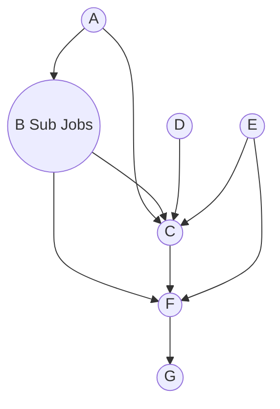

# swarm

swarm蜂群任务执行引擎

# 支持功能

## 单机DAG任务流

十字链表实现的DAG

- 子任务
- 参数共享
- spring容器自动构造job

# 使用说明

## 导入maven依赖

```xml

<dependency>
    <groupId>com.original</groupId>
    <artifactId>swarm</artifactId>
    <version>${swarm-latest.version}</version>
</dependency>
```

## 构建DAG任务流

对于如下DAG任务:



满足任务执行流程的一个拓扑排序是[A, D, E, B, C, F, G]

### spring容器构造方式

- 定义如下bean

```java
public class SampleConfig {

    @Bean("A")
    public Job a() {
        return jobExecuteContext -> System.out.println("doing A");
    }

    /**
     * B-Sub1和B-Sub2组成一个聚合任务
     * @return
     */
    @Bean("B-Sub1")
    public Job bSub1() {
        return jobExecuteContext -> System.out.println("doing B-Sub1");
    }

    @Bean("B-Sub2")
    public Job bSub2() {
        return jobExecuteContext -> System.out.println("doing B-Sub2");
    }

    @Bean("C")
    public Job c() {
        return jobExecuteContext -> System.out.println("doing C");
    }

    @Bean("D")
    public Job d() {
        return jobExecuteContext -> System.out.println("doing D");
    }

    @Bean("E")
    public Job e() {
        return jobExecuteContext -> System.out.println("doing E");
    }

    @Bean("F")
    public Job f() {
        return jobExecuteContext -> System.out.println("doing F");
    }

    @Bean("G")
    public Job g() {
        return jobExecuteContext -> System.out.println("doing G");
    }
}

```

- 配置任务依赖链路json文件

```json
{
  "chainName": "SampleJobComb",
  "jobs": [
    {
      "id": 0,
      "name": "A"
    },
    {
      "id": 1,
      "name": "B",
      "parallelJobs": [
        {
          "name": "B-Sub1"
        },
        {
          "name": "B-Sub2"
        }
      ]
    },
    {
      "id": 2,
      "name": "C"
    },
    {
      "id": 3,
      "name": "D"
    },
    {
      "id": 4,
      "name": "E"
    },
    {
      "id": 5,
      "name": "F"
    },
    {
      "id": 6,
      "name": "G"
    }
  ],
  "edges": [
    {
      "fromId": 0,
      "toId": 1
    },
    {
      "fromId": 0,
      "toId": 2
    },
    {
      "fromId": 1,
      "toId": 2
    },
    {
      "fromId": 3,
      "toId": 2
    },
    {
      "fromId": 4,
      "toId": 2
    },
    {
      "fromId": 1,
      "toId": 5
    },
    {
      "fromId": 2,
      "toId": 5
    },
    {
      "fromId": 4,
      "toId": 5
    },
    {
      "fromId": 5,
      "toId": 6
    }
  ]
}
```

- 通过JobFactory加载DAG并执行

```java
import job.com.original.swarm.DirectedAcyclicGraphJobFactory;
import job.com.original.swarm.JobExecuteContext;
import job.com.original.swarm.JobExecuteData;
import org.springframework.beans.factory.annotation.Autowired;
import job.com.original.swarm.DirectedAcyclicGraphChainJob;

public class MyService {
    @Autowired
    private DirectedAcyclicGraphJobFactory jobFactory;

    public void test() {
        DirectedAcyclicGraphChainJob dagJob =
            (DirectedAcyclicGraphChainJob) this.jobFactory.getJob("SampleJobComb", null);
        // 创建一个任务上下文并执行
        dagJob.execute(new JobExecuteContext() {
            @Override
            public boolean belongToChainJob() {
                return true;
            }

            @Override
            public String chainName() {
                return jobConfig.getChainName();
            }

            @Override
            public JobExecuteData getJobExecuteData() {
                return new JobExecuteData();
            }
        });
    }
}
```

## 参数共享

`Job`接口的`void execute(JobExecuteContext jobExecuteContext) throws JobExecutionFailedException;`
方法入参用于获取任务上下文，其中的`JobExecuteData getJobExecuteData();`
方法用于获取整个DAG任务链全局共享的参数.具体使用参考`com.original.swarm.DagJobTest.salesSummaryTest`

# 版本说明

## 0.0.1

- 项目初始化
- DAG单机工作流
- spring容器自动构造